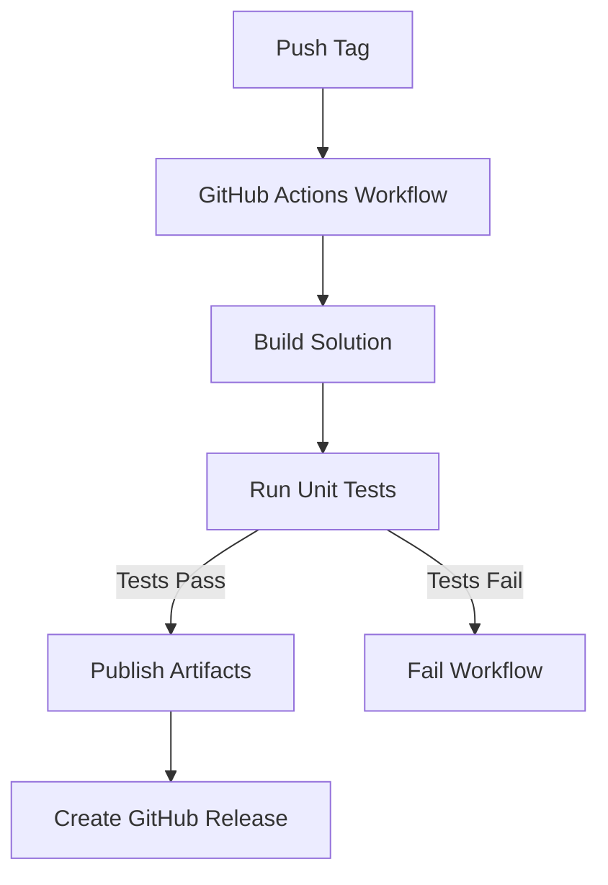

# Hello World GitHub Release Example / Ejemplo de Release con GitHub Actions

**English** | [Español más abajo](#instrucciones-en-español)

This repository demonstrates how to automate the release process of a simple C# "Hello World" application using GitHub Actions. It is designed as an educational example to help you understand and replicate a basic CI/CD workflow for .NET projects.

## What This Project Demonstrates

- How to structure a minimal C# project for version control and CI/CD.
- How to configure a GitHub Actions workflow to build, publish, and release a .NET application automatically when a new tag is pushed.
- The basics of tagging releases in Git and how this triggers automated workflows.
- Best practices for open source project automation.


## Prerequisites

To run, build, and experiment with this project, you will need:

- **.NET SDK 6.0 or later** ([Download .NET](https://dotnet.microsoft.com/download))
- **Git** ([Download Git](https://git-scm.com/downloads))
- A **GitHub account**
- (Recommended) **Visual Studio Code** or **Visual Studio 2022+** for easier editing and debugging
- (Optional) **GitHub CLI** ([Download GitHub CLI](https://cli.github.com/)) for advanced repository management
- **IMPORTANT:** In your repository, go to `Settings > Actions > General > Workflow permissions` and select **Read and write permissions**. This is required for GitHub Actions to create releases automatically.


## Recomendación importante en español

En la configuración del repositorio en GitHub, ve a `Settings > Actions > General > Workflow permissions` y selecciona **Read and write permissions**. Esto es necesario para que los workflows puedan crear releases automáticamente.

---

## Recommendations

- Use Visual Studio Code with the C# and GitHub Actions extensions for the best experience.
- Familiarize yourself with basic Git commands and GitHub repository management.
- Review the [GitHub Actions documentation](https://docs.github.com/en/actions) to understand workflow syntax and capabilities.


## CI/CD Pipeline Diagram



## Build Status


## Project Structure

```
HelloWorld-GitHubRelease
├── HelloWorld/                # Main C# project
│   ├── HelloWorld.csproj
│   └── Program.cs
├── HelloWorld.Tests/          # Unit tests (xUnit)
│   ├── HelloWorld.Tests.csproj
│   └── ProgramTests.cs
├── .github/
│   └── workflows/
│       └── release.yml
├── HelloWorld-GitHubRelease.sln
└── README.md
```


## How to Run the Application Locally

1. Clone the repository to your local machine:
   ```sh
   git clone https://github.com/your-username/HelloWorld-GitHubRelease.git
   cd HelloWorld-GitHubRelease
   ```
2. Build the project:
   ```sh
   dotnet build ./HelloWorld-GitHubRelease.sln
   ```
3. Run the application:
   ```sh
   dotnet run --project ./HelloWorld/HelloWorld.csproj
   ```
   You should see the output:
   ```
   Hello, World!
   ```


4. Run the tests:
   ```sh
   dotnet test
   ```

## Code Coverage

To generate a code coverage report, run:

```sh
dotnet test --collect:"XPlat Code Coverage"
```

You can use [Coverlet](https://github.com/coverlet-coverage/coverlet) and [ReportGenerator](https://github.com/danielpalme/ReportGenerator) for advanced reports.
## Error Handling

The sample project can be extended to demonstrate error handling. For example, you can add try-catch blocks in your code and write unit tests to verify error scenarios.

## Versioning

This project uses [Semantic Versioning (SemVer)](https://semver.org/). Tags should follow the format `vMAJOR.MINOR.PATCH` (e.g., `v1.0.0`).

## GitHub Actions Workflow Permissions

To allow the workflow to create releases, go to your repository's **Settings > Actions > General > Workflow permissions** and select **Read and write permissions**.  


## References

- [.NET Documentation](https://docs.microsoft.com/dotnet/)
- [GitHub Actions Documentation](https://docs.github.com/en/actions)
- [xUnit Documentation](https://xunit.net/)
- [Semantic Versioning](https://semver.org/)

## Project Structure Explained

```
HelloWorld-GitHubRelease/
├── HelloWorld-GitHubRelease.sln
├── HelloWorld/
│   ├── HelloWorld.csproj
│   └── Program.cs
├── HelloWorld.Tests/
│   ├── HelloWorld.Tests.csproj
│   └── ProgramTests.cs
├── .github/
│   ├── workflows/
│   │   └── release.yml
│   ├── ISSUE_TEMPLATE/
│   │   └── bug_report.md
│   └── PULL_REQUEST_TEMPLATE.md
├── README.md
└── docs/
   └── workflow-permissions.png
```

## FAQ

**Q: Why does the release step fail with a 403 error?**  
A: Make sure you have set "Read and write permissions" for workflows in your repository settings.

**Q: Why does `dotnet run` not work from the root?**  
A: Use `dotnet run --project ./HelloWorld/HelloWorld.csproj` to specify the project file.


## Lessons Learned / Lecciones Aprendidas

**English**

- Always ensure your solution (.sln) only references existing project files. If you move or delete a project, update the solution accordingly to avoid build errors in CI/CD.
- The path in the publish step of your workflow must match the actual location of your .csproj file. Otherwise, the build or publish will fail.
- Add a test step in your workflow to prevent broken releases. If tests fail, the release should not be created.
- Keep your project structure simple and clear. Remove unused folders or files to avoid confusion and errors.
- Use clear, bilingual commit messages and documentation if your audience is multilingual.

**Español**

- Asegúrate de que la solución (.sln) solo tenga referencias a proyectos que realmente existen. Si mueves o eliminas un proyecto, actualiza la solución para evitar errores de compilación en CI/CD.
- La ruta en el paso de publicación del workflow debe coincidir con la ubicación real del archivo .csproj. Si no, fallará el build o publish.
- Agrega un paso de pruebas en el workflow para evitar releases rotos. Si las pruebas fallan, el release no debe generarse.
- Mantén la estructura del proyecto simple y clara. Elimina carpetas o archivos que no se usen para evitar confusiones y errores.
- Usa mensajes de commit y documentación bilingües si tu audiencia es multilingüe.

---

## How the GitHub Actions Workflow Works

The workflow file is located at `.github/workflows/release.yml`. It automates the following steps:

1. **Trigger**: The workflow runs when you push a tag that matches the pattern `v*.*.*` (e.g., `v1.0.0`).
2. **Build**: Checks out the code, sets up the .NET environment, restores dependencies, and builds the project in Release mode.
3. **Test**: Runs all unit tests. If any test fails, the workflow stops and no release is created.
4. **Publish**: Publishes the compiled application to the `output` directory.
5. **Release**: Creates a new GitHub Release and uploads the published files as release assets.
---

## Instrucciones en Español

Este repositorio demuestra cómo automatizar el proceso de release de una aplicación C# "Hello World" usando GitHub Actions. Es un ejemplo educativo para aprender a crear un flujo CI/CD básico para proyectos .NET.

### Estructura del Proyecto

```
HelloWorld-GitHubRelease
├── HelloWorld/                # Proyecto principal en C#
│   ├── HelloWorld.csproj
│   └── Program.cs
├── HelloWorld.Tests/          # Pruebas unitarias (xUnit)
│   ├── HelloWorld.Tests.csproj
│   └── ProgramTests.cs
├── .github/
│   └── workflows/
│       └── release.yml
├── HelloWorld-GitHubRelease.sln
└── README.md
```

### Cómo ejecutar la aplicación

1. Clona el repositorio:
   ```sh
   git clone https://github.com/tu-usuario/HelloWorld-GitHubRelease.git
   cd HelloWorld-GitHubRelease
   ```
2. Compila el proyecto:
   ```sh
   dotnet build ./HelloWorld-GitHubRelease.sln
   ```
3. Ejecuta la aplicación:
   ```sh
   dotnet run --project ./HelloWorld/HelloWorld.csproj
   ```
   Deberías ver:
   ```
   Hello, World!
   ```
4. Ejecuta las pruebas:
   ```sh
   dotnet test
   ```

### Cómo funciona el workflow de GitHub Actions

1. **Disparo**: El workflow se ejecuta al hacer push de un tag tipo `v*.*.*` (ej: `v1.0.0`).
2. **Build**: Restaura dependencias y compila en modo Release.
3. **Test**: Ejecuta las pruebas unitarias. Si alguna falla, el workflow se detiene y no se crea el release.
4. **Publish**: Publica la app compilada en la carpeta `output`.
5. **Release**: Crea un Release en GitHub y sube los archivos publicados como assets.

### How to Trigger the Workflow

1. Make sure all your changes are committed:
   ```sh
   git add .
   git commit -m "Your message"
   git push
   ```
2. Create a new tag (e.g., `v1.0.0`):
   ```sh
   git tag v1.0.0
   git push origin v1.0.0
   ```
3. The workflow will start automatically. You can monitor progress in the GitHub Actions tab of your repository.

## Customization

- You can modify the workflow file to add tests, change build configurations, or upload different assets.
- For more details, see the comments in `.github/workflows/release.yml` and the [GitHub Actions documentation](https://docs.github.com/en/actions).

---

This project is intended as a learning resource for anyone interested in automating .NET releases with GitHub Actions.